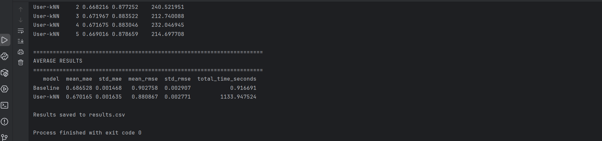
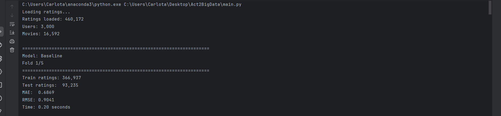
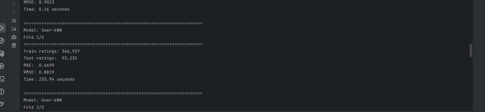

# 🎬 Movie Recommender System

Movie recommendation system implemented in **Python** using a **baseline model** and **user-based collaborative filtering with K-Nearest Neighbors (KNN)**.

The project compares both approaches using the **MovieLens** ratings dataset and evaluates their performance with cross-validation and standard recommendation metrics.

---

## 🎯 Project Overview

The goal of this project is to predict how a user would rate a movie based on historical rating data.

Two recommendation approaches are implemented:

- **Baseline Recommender**
- **User-based KNN Recommender**

The models are evaluated using **MAE** and **RMSE**, allowing their prediction performance to be compared objectively.

---

## 📌 Baseline Recommender

The baseline model predicts a rating using general rating tendencies.

It combines:

- The global mean rating.
- User-specific bias.
- Movie-specific bias.

This provides a strong reference model before applying a more complex collaborative filtering approach.

Conceptually, the prediction follows:

```text
prediction = global mean + user bias + movie bias
```

The prediction is clipped to remain inside the valid rating range.

---

## 👥 User-Based KNN Recommender

The KNN recommender predicts a user's rating by finding other users with similar rating behaviour.

The main idea is:

1. Find users who have rated the target movie.
2. Measure their similarity to the target user.
3. Select the `k` most similar neighbors.
4. Use their ratings to estimate the target user's rating.

The final prediction adjusts each neighbor's rating according to their own average rating behaviour.

---

## 📐 User Similarity

Similarity between users is calculated using the **Pearson correlation coefficient** over movies rated by both users.

This helps identify users whose rating patterns behave similarly, even if their absolute rating scales differ.

To avoid recalculating the same values repeatedly, user similarities are stored in a **similarity cache**.

---

## 🧠 Prediction Process

For a target user and movie:

1. Retrieve users who rated the movie.
2. Compute or retrieve cached similarities.
3. Sort candidate neighbors by similarity.
4. Keep the top `k` neighbors.
5. Compute a weighted prediction using neighbor similarities.
6. Fall back to the baseline model if no useful neighbors are available.
7. Clip the final prediction to the valid rating range.

This combines the robustness of the baseline model with the personalization of collaborative filtering.

---

## ✅ Model Evaluation

The project evaluates both recommendation models using:

- **MAE — Mean Absolute Error**
- **RMSE — Root Mean Squared Error**

Lower values indicate better prediction accuracy.

The evaluation uses **5-fold cross-validation**, splitting each user's ratings across multiple training and validation folds.

This provides a more reliable estimate of model performance than evaluating on a single train-test split.

---

## 📊 Experimental Results

The repository includes:

- `results.csv`
- `Averageresults.png`
- `Baseline1erfold.png`
- `KNN1erfold.png`

These files summarize and visualize the evaluation results obtained during the experiments.

### Average Results



### Baseline — First Fold



### User-KNN — First Fold



---

## 🛠️ Technologies Used


### Main libraries

- `pandas`
- `numpy`
- `matplotlib`

---

## 📂 Project Structure

```text
movie-recommender-system/
│
├── baseline.py
├── data.py
├── evaluation.py
├── main.py
├── metrics.py
├── user_knn.py
├── requirements.txt
├── results.csv
├── Averageresults.png
├── Baseline1erfold.png
├── KNN1erfold.png
└── README.md
```

### `baseline.py`

Implements the baseline recommendation model using global, user and movie rating tendencies.

### `user_knn.py`

Implements user-based collaborative filtering, Pearson similarity, neighbor selection and rating prediction.

### `data.py`

Handles rating data loading and preparation.

### `evaluation.py`

Contains the evaluation and cross-validation logic.

### `metrics.py`

Implements the error metrics used to compare models.

### `main.py`

Runs the complete experiment and compares the recommendation approaches.

---

## ▶️ How to Run

1. Clone the repository:

```bash
git clone https://github.com/CarlotaAyala/movie-recommender-system.git
```

2. Enter the project directory:

```bash
cd movie-recommender-system
```

3. Install the dependencies:

```bash
pip install -r requirements.txt
```

4. Run the project:

```bash
python main.py
```

Make sure the required MovieLens data is available in the location expected by `data.py`.

---

## 💡 What I Learned

This project helped me understand how recommendation systems can combine simple statistical baselines with neighborhood-based collaborative filtering.

In particular, I worked with:

- Recommendation systems.
- User-based collaborative filtering.
- K-Nearest Neighbors.
- Pearson similarity.
- Similarity caching.
- Rating normalization.
- Baseline prediction.
- Cross-validation.
- MAE and RMSE.
- Model comparison.
- Efficient data structures for user-item relationships.

It also helped me understand why a simpler baseline model is useful when evaluating whether a more complex recommendation method actually improves prediction quality.

---

## 🎓 Academic Context

This project was developed as part of the **Big Data** course in the **Data Science and Engineering** degree at the **University of Maribor**.

---

## 👩‍💻 Author

**Carlota Ayala**

Data Science and Engineering student  
University of Las Palmas de Gran Canaria (ULPGC)
